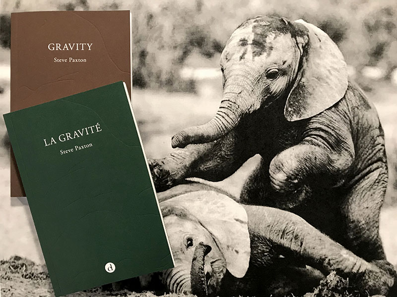

## Publications

[*Gravity*](https://www.contredanse.org/contredanseV4/templates/index.php?path=eshop/action_search.php&product_id=218) de Steve Paxton, Éditions Contredanse, Bruxelles, 2018.

[*La gravité*](https://www.contredanse.org/contredanseV4/templates/index.php?path=eshop/action_search.php&product_id=219) de Steve Paxton, traduit de l'américain par Denise Luccioni, Éditions Contredanse, Bruxelles, 2018.

Dans cet opuscule inédit, le danseur Steve Paxton retrace une vie en compagnie de la force de gravité. Des souvenirs du premier vol en avion aux cours de danse, de méditations métaphysiques à l'observation de cochons, Steve Paxton interroge ce qui est à la limite de notre conscience et convie nos sens à entrer dans la danse.  

[*Material for the Spine, une étude du mouvement*](https://www.contredanse.org/contredanseV4/templates/index.php?path=eshop/action_search.php&product_id=212) de Steve Paxton, Baptiste Andrien et Florence Corin, Contredanse Éditions, Bruxelles, 2008.

Steve Paxton publie de nombreux articles à partir de 1975 dans la revue de danse [*Contact Quarterly*](https://contactquarterly.com/). Il écrit notamment sur la danse pour les handicapés, la danse pour les malvoyants, sur l’analyse de la danse, sur la technique et la théorie du Contact Improvisation et divers autres thèmes. 

Plusieurs ouvrages parlent de son travail, notamment : *Terpsichore en baskets*, Sally Banes, traduction Denise Luccioni, Éditions CND/Chiron, juin 2002 ; *The Rise and Fall and Rise of Modern Dance*, Don McDonagh, ebrandedbooks.com, US, revised edition, 1 décembre 1990 ; *Sharing the Dance: Contact Improvisation & American Culture*, Cynthia Novack, University of Wisconsin Press; 1990 ; *Democracy's Body: Judson Dance Theater, 1962-64*, Sally Banes, Duke University Press Books, 1993 ; *Dance as a Theatre Art, Source Readings in Dance History from 1581 to the Present*, ss la dir. de Selma Jeanne Cohen, Princeton Book Company, 1992 ; *The Grand Union (1970-1976): An Improvisational Performance Group*, Margaret Hupp Ramsay, Peter Lang Publishing Inc, 1991.

## Vidéos

Steve Paxton a écrit et conçu plusieurs vidéos : *Peripheral Vision*, 1975 ; *Chute*, 1979 ; *Fall After Newton*, 1987 (qui documentent notamment les débuts du Contact Improvisation), édités sur [*Videoda Contact Improvisation Archive, Collected Edition 1972 – 1983*](https://contactquarterly.com/contact-editions/index.php#book=videoda-contact-improvisation-archive-(dvd)), VIDEODA, Vermont, 2014.

Certaines danses de Steve Paxton ont été filmées dans *Dance in America*, 1980, chaîne de télévision PBS ; *Dance and Dancing*, 1992, PBS ; *Goldberg Variations1-15 & 16-30*, Steve Paxton, Walter Verdin, 1992, (KAAI Theater, Belgique & The Kitchen, New York)
